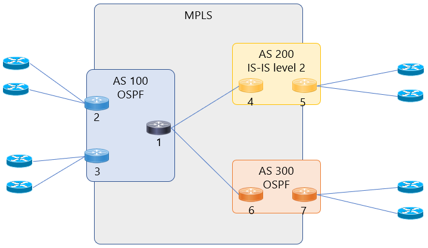
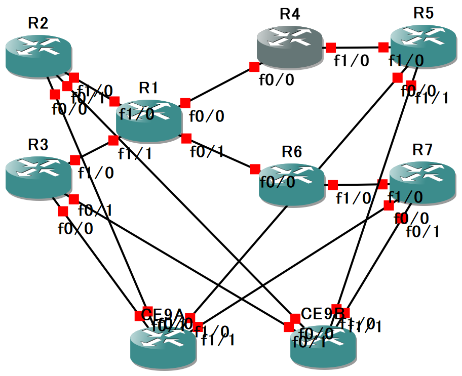

# Multi_AS_MPBGP_Practice
Practice repository - Upload the config to work. 

MPLS-VPN をベースにしたバックボーン環境を構築する。MP-BGPはマルチASとし、異なるASを接続した通信を実装する。

## 前提条件
Cisco 製品のみを利用した、シングルベンダー構成とし、GNS3で仮想的に動作させる。 
* All routers: Cisco 7200 Series - IOS ver 15.2

## Network diagram
* Inner-AS: ```192.168.xx.xx/24```
* Inter-AS: ```172.24.xx.xx/24```
* Mgmt IP: ```100.0.x.x/32```



### Network diagram for GNS3


## 設計詳細

* 参考URL: [MPLS-VPN - ネットワークエンジニアとして](https://www.infraexpert.com/study/mpls6.html)
* 参考URL: [IOS および IOS XR を使用したレイヤ 3 MPLS VPN INTER-AS オプション B の設定と検証](https://www.cisco.com/c/ja_jp/support/docs/multiprotocol-label-switching-mpls/mpls/200557-Configuration-and-Verification-of-Layer.html)

### Underlay IGP - OSPF
UnderlayのIGPとして、本構成ではOSPFを動作させる。マルチベンダー環境で動作できるようIS-ISかOSPFがIGPとして利用されることが多いが、日本ではもっぱらOSPFが利用されることが多い。 \
物理ポートのルート情報はIGPのみに完結させ、ルータ内部のアドレスであるLoopback InterfaceのIPアドレスをIGPで共有し合う。\
ラベル情報を共有するMPLSやユーザ通信のルート情報を共有するMP-BGPはLoopback Interfaceを管理IPとして利用し、物理障害の影響を最小限とするためである。\
必要なインターフェースのみ有効化させる。\
設定例（RR1）：
```
router ospf 100
 network 192.168.0.0 0.0.255.255 area 0
 network 100.0.0.0 0.0.0.255 area 0
 passive-interface default
 no passive fa1/0
 no passive fa1/1
```

### Underlay - MPLS
ラベル情報を付与するため、UnderlayにてMPLSを動作させる。CiscoであればCEFが必須である点に注意。 \
大まかに4つの機能が存在: 
* Insert: 「IPパケットへのラベル付加」。初めてMPLS網内に入ったパケットに対し、ラベル情報を付与。
* Swap: 「先頭ラベルの交換」。受信したラベルをNext-hopのラベルに付け替え。
* Pop: 「先頭ラベルの除去」。PHP (Penultimate Hop Poping) 有効時に、MPLS網から出る一つ手前の機器で除去。Penultimateは「最後から2番目の」という意味。
* Untag: 「全ラベルの除去」。MPLS網から出るタイミングで全ラベル情報を除去。

通常、ルータ内では、コントロールプレーンとしてルーティング(RIB)テーブル、データプレーンとしてFIBテーブルを保持するが、MPLS-VPNでは2つのテーブルが追加となる。
* コントロールプレーン:
  * ルーティング(RIB)テーブル: ルーティングプロトコルの設定により作成。IPプレフィックスに対するNext-hop情報を保持。
  * LIBテーブル: LDPの設定により作成。IPプレフィックスに対する自ラベル（Local Label）とNext-hopのラベル（Remote Label）情報を保持。
* データプレーン:
  * FIBテーブル: ルーティングテーブルをベースに作成。IPパケット転送にて、実際のNext-hopのIP情報とラベル情報を参照。
  * LIBテーブル: LIBテーブルをベースに作成される。MPLS網内の中継機器によるラベル付きパケット転送にて使用。

Ciscoにて使用するshowコマンド: 
```
◇　ルーティングテーブル
⇒　show ip route

◇　LIBテーブル
⇒　show mpls ldp binding

◇　FIBテーブル
⇒　show ip cef

◇　LFIBテーブル
⇒　show mpls forwarding-table
```

設定例（RR1）：
```
※デフォルトでLDPが動作
◇　Inner ASのMPLS設定
int fa1/0
 description *** From R1 to R2 ***
 ip address 192.168.12.1 255.255.255.0
 mpls ip

◇　Inter ASのMPLS設定
int fa0/0
 description *** From R1 to R4 ***
 ip address 172.24.14.1 255.255.255.0
 mpls bgp forwarding
```


### Overlay - MP-BGP via MPLS-VPN
複数のユーザを同一機器に仮想的に収容しつつも、ルーティングテーブルをVRFにて分割する。\
分割したルーティング情報をMP-BGPにて伝搬する。

通信の流れ：
①　ユーザごとのルーティング情報にRD(Route Distinguisher)を付加することで重複のないVPNv4プレフィックスを作成可能。拡張コミュニティを使用。\
異なるRD値を設定することによって、PEルータのMP-BGPテーブル上で経路情報を区別可能。\
* VPNv4プレフィックス: RD (64 bits) + IPv4 (32bits) にて構成されるルート情報

②　VPNv4プレフィックスにさらにアトリビュートとして、RT（Route Target）を付加して通知。受信したVPNv4プレフィックスに含まれたRTの値を見てimport値が同じVRFに転送する。

③　PEルータ間でカスタマーごとのVRFの経路情報を交換します。各PEルータ内でVRFの経路情報をグローバルルーティングテーブルに再配布。

設定例（RR1）：
```
※RR1はルートリフレクターとしても動作するため、route-reflector-clientの設定も必要。
ip vrf Apple
 rd 100.0.10.1:100
 route-target export 10:100
 route-target import 10:100
!
ip vrf Peach
 rd 100.0.20.1:200
 route-target export 20:200
 route-target import 20:200
!
router bgp 100
 address-family vpnv4
  neighbor 100.0.0.2 activate
  neighbor 100.0.0.2 route-reflector-client
  neighbor 100.0.0.2 send-community both
  neighbor 100.0.0.3 activate
  neighbor 100.0.0.3 route-reflector-client
  neighbor 100.0.0.3 send-community both
  neighbor 172.24.14.4 activate
  neighbor 172.24.14.4 send-community both
  neighbor 172.24.16.6 activate
  neighbor 172.24.16.6 send-community both
 exit-address-family
!
```

